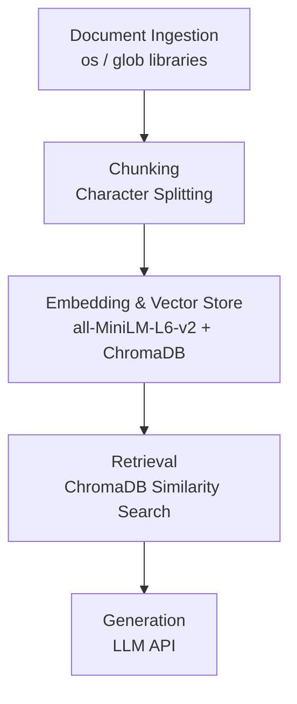

# Project 1 Planning: The Unofficial Guide

> Write this document before you write any pipeline code.
> Your spec and architecture diagram are what you'll use to direct AI tools (Claude, Copilot, etc.) to generate your implementation — the more specific they are, the more useful the generated code will be.
> Update the Retrieval Approach and Chunking Strategy sections if you change your approach during implementation.
> Update this file before starting any stretch features.

---

## Domain

**ASU CS/Software Engineering Course & Professor Guide (Fulton Schools)**

Official ASU course catalogs provide the syllabus, but they don't capture the student experience—such as how harsh a grader a professor is, which electives are most useful for software engineering interviews, or which prerequisite courses are the most notoriously difficult. This knowledge is incredibly valuable for students planning their schedules but is typically scattered across Reddit threads, Discord servers, and word-of-mouth, making it hard to find and aggregate efficiently.

---

## Documents

<!-- List your specific sources: URLs, subreddit names, forum threads, or file descriptions.
     Aim for at least 10 sources that together cover different subtopics or perspectives within your domain. -->

| # | Source | Description | URL or location |
|---|--------|-------------|-----------------|
| 1 | Reddit r/ASU | Summary of CSE 310 (Data Structures and Algorithms) student discussions | `documents/cse310_reddit_summary.txt` |
| 2 | Reddit r/ASU | Summary of CSE 340 (Principles of Programming Languages) student discussions | `documents/cse340_reddit_summary.txt` |
| 3 | Reddit r/ASU | Summary of CSE 240 (Introduction to Programming Languages) student discussions | `documents/cse240_reddit_summary.txt` |
| 4 | Reddit r/ASU | Summary of CSE 110 (Principles of Programming with Java) student discussions | `documents/cse110_reddit_summary.txt` |
| 5 | Reddit r/ASU | Summary of reviews for Professor Ryan Meuth | `documents/ryan_meuth_reviews.txt` |
| 6 | Reddit r/ASU | Summary of CSE 412 (Database Management) student discussions | `documents/cse412_reddit_summary.txt` |
| 7 | Reddit r/ASU | Summary of CSE 355 (Intro to Theoretical Computer Science) student discussions | `documents/cse355_reddit_summary.txt` |
| 8 | Reddit r/ASU | Summary of reviews for Professor Mutsumi Nakamura | `documents/mutsumi_nakamura_reviews.txt` |
| 9 | Reddit r/ASU | Summary of CSE 445 (Distributed Software Development) student discussions | `documents/cse445_reddit_summary.txt` |
| 10 | Reddit r/ASU | Summary of reviews for Professor Yinong Chen | `documents/yinong_chen_reviews.txt` |

---

## Chunking Strategy

<!-- How will you split documents into chunks?
     State your chunk size (in tokens or characters), overlap size, and explain why those
     numbers fit the structure of your documents.
     A review-heavy corpus warrants different chunking than a long FAQ. -->

**Chunk size:** 500 characters

**Overlap:** 100 characters

**Reasoning:** The documents are relatively short summaries of Reddit discussions structured with bullet points. A chunk size of 500 characters captures roughly 2-3 bullet points or a full short paragraph, providing enough self-contained context to answer a specific query. An overlap of 100 characters ensures that if a key point or context (like the professor's name) spans the boundary between two adjacent chunks, neither chunk loses the crucial connection.

---

## Retrieval Approach

<!-- Which embedding model are you using (e.g., all-MiniLM-L6-v2 via sentence-transformers)?
     How many chunks will you retrieve per query (top-k)?
     If you were deploying this for real users and cost wasn't a constraint, what tradeoffs
     would you weigh in choosing a different embedding model — context length, multilingual
     support, accuracy on domain-specific text, latency? -->

**Embedding model:** `all-MiniLM-L6-v2` via `sentence-transformers`

**Top-k:** 3

**Production tradeoff reflection:** If cost and compute constraints were removed, I would consider using a larger, more sophisticated model like OpenAI's `text-embedding-3-large` or `BGE-m3`. These models have larger context windows and better capture nuanced semantics, which is helpful for decoding student slang or highly domain-specific colloquialisms. However, for short, English-based review text, `all-MiniLM-L6-v2` provides an excellent balance of acceptable accuracy with very low latency, and it runs locally without API costs.

---

## Evaluation Plan

<!-- List your 5 test questions with their expected correct answers.
     Questions should be specific enough that you can judge whether the system's response
     is right or wrong. "What are good dining halls?" is too vague.
     "What do students say about wait times at [dining hall name] during lunch?" is testable. -->

| # | Question | Expected answer |
|---|----------|-----------------|
| 1 | What do students say about the workload and projects for CSE 340, and what is the best way to manage it? | Projects are very time-intensive (often 30-40 hours each). Students highly recommend starting projects as early as possible, ideally on the day they are assigned. |
| 2 | What programming language is used in CSE 310, and what specific concepts should I be comfortable with before taking it? | C++. You should be comfortable with pointers, memory management, and debugging. |
| 3 | What is the general student consensus on Professor Ryan Meuth, and what external resource of his is highly recommended? | He is widely considered one of the best professors at ASU. His YouTube instructional videos are highly recommended, particularly for understanding CSE 230 topics. |
| 4 | How does CSE 355 differ from practical programming courses, and what YouTube channel do students recommend for it? | It is a theory-heavy, proof-based course, compared to an advanced version of Discrete Math. Students highly recommend "Easy Theory" on YouTube. |
| 5 | What is Professor Yinong Chen's exam format in CSE 445, and what is the key strategy for success on these exams? | His exams are typically open-note. The key strategy is having well-indexed notes and strong "Ctrl+F" skills to quickly locate information during the test. |

---

## Anticipated Challenges

<!-- What could go wrong? Name at least two specific risks with reasoning.
     Consider: noisy or inconsistent documents, missing source attribution, off-topic
     retrieval, chunks that split key information across boundaries. -->

1. **Contradictory opinions:** Reddit reviews are highly subjective. Different chunks might contain conflicting advice (e.g., one student says a class is an "easy A," while another calls it a "GPA killer"). The generation stage might struggle to synthesize this if the prompt doesn't explicitly instruct the LLM to present both sides.

2. **Loss of context in chunks:** Even with overlap, a chunk might capture a bullet point saying "The projects are brutal" but miss the preceding header specifying "In CSE 340." If retrieved independently, the context is ambiguous, potentially leading to inaccurate generation.

---

## Architecture

---

## AI Tool Plan

<!-- For each part of the pipeline below, describe:
     - Which AI tool you plan to use (Claude, Copilot, ChatGPT, etc.)
     - What you'll give it as input (which sections of this planning.md, which requirements)
     - What you expect it to produce
     - How you'll verify the output matches your spec

     "I'll use AI to help me code" is not a plan.
     "I'll give Claude my Chunking Strategy section and ask it to implement chunk_text()
     with my specified chunk size and overlap" is a plan. -->

**Milestone 3 — Ingestion and chunking:** I will prompt an AI tool (like Claude) with my "Chunking Strategy" section. I will ask it to write a Python script using standard libraries to iterate over the text files in the `documents/` directory, read their contents, and split them into chunks of 500 characters with 100 characters overlap. I expect it to produce a script that outputs a clean list of dictionaries containing the text chunk and source metadata.

**Milestone 4 — Embedding and retrieval:** I will provide the AI with my "Architecture" diagram and "Retrieval Approach" section. I will ask it to write the code to initialize a local ChromaDB instance, embed the chunks using `sentence-transformers` (`all-MiniLM-L6-v2`), and write a function `retrieve(query)` that returns the top 3 chunks. I will verify this by printing the retrieved chunks for a test query to ensure they are relevant.

**Milestone 5 — Generation and interface:** I will give the AI my "Evaluation Plan" and ask it to write a generation function that takes the retrieved context, passes it to an LLM API (e.g., Groq or OpenAI), and strictly grounds the answer in the context provided. I will verify it by running the 5 evaluation questions from planning.md and comparing the output to the expected answers.
